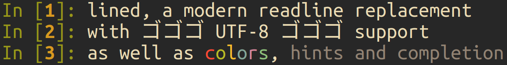

# lined

<p align="center">
      
</p>

## Features

* Blocking (with cancellation) and non-blocking modes of operation
* UTF-8 support
* History
* Hints, completion and colorization
* Can be used simultaneously with other console output (e.g. logging)

## Example

```cpp
#include "lined/lined.hpp"
#include <iostream>

int main() {
    lined::line_reader reader;
    while (true) {
        auto line = reader.getline("> ");
        if (line) {
            if (*line == "save") {
                reader.save_history("history.txt");
            } else if (*line == "load") {
                reader.load_history("history.txt");
            } else if (*line == "clear") {
                reader.clear_screen();
            } else {
                std::cout << *line << std::endl;
            }
        } else if (line.error() == lined::line_error::ctrl_c) {
            break;
        }
    }
}
```

## Requirements

lined requires a C++17 compiler and a POSIX compliant OS.

## Acknowledgements

Special thanks to [linenoise](https://github.com/antirez/linenoise) for some of the terminal handling code, and [wcwidth9](https://github.com/joshuarubin/wcwidth9) for the character width code.
